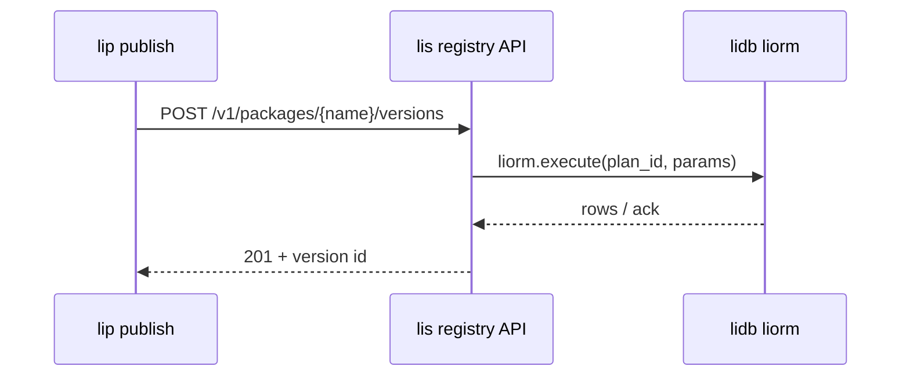

# PH-DB registry publish — cross-repo integration

End-to-end path for **`lip publish --registry`** against a registry API backed by **lis** (mock or lidb) and schema from **lidb**.

## Repos and PRs (2026-05-25)

| Repo | PR | Role |
|------|-----|------|
| [roadmap](https://github.com/li-langverse/roadmap) | [#14](https://github.com/li-langverse/roadmap/pull/14), [#15](https://github.com/li-langverse/roadmap/pull/15) | PH-DB-0 ADR + ecosystem PH table |
| [lidb](https://github.com/li-langverse/lidb) | [#1](https://github.com/li-langverse/lidb/pull/1) ✓, [#3](https://github.com/li-langverse/lidb/pull/3) ✓, [#4](https://github.com/li-langverse/lidb/pull/4), [#2](https://github.com/li-langverse/lidb/pull/2) | Engine, liorm/liq, RLS |
| [lis](https://github.com/li-langverse/lis) | [#5](https://github.com/li-langverse/lis/pull/5), [#6](https://github.com/li-langverse/lis/pull/6) | `registry-min` bundle, REST routes |
| [lip](https://github.com/li-langverse/lip) | [#13](https://github.com/li-langverse/lip/pull/13), [#14](https://github.com/li-langverse/lip/pull/14) | OpenAPI + HTTP publish client |
| [benchmarks](https://github.com/li-langverse/benchmarks) | [#72](https://github.com/li-langverse/benchmarks/pull/72), [#74](https://github.com/li-langverse/benchmarks/pull/74) | `tier_db_registry` + graph/vector/gpu stubs |
| [li-cursor-agents](https://github.com/li-langverse/li-cursor-agents) | [#16](https://github.com/li-langverse/li-cursor-agents/pull/16), [#17](https://github.com/li-langverse/li-cursor-agents/pull/17) | Control-plane liq stub |

Merge order: roadmap → lidb (#3, #4, rebase #2) → benchmarks #72 → #74 → lis #5 → #6 → lip #13 → #14 → li-cursor-agents #17.

## Target flow (v2 registry)



Today: **lis** uses `routes/registry/liorm_mock.py` until lidb **#4** and engine wiring land.

## Local E2E (after lip #14 merges)

### A — lip in-process mock (CI today on PR branch)

On branch `feat/ph-db-4-lip-publish-client`:

```bash
cd lip
./scripts/registry-http-test.sh
```

Starts `scripts/registry_mock_server.py`, runs `lip publish --registry http://127.0.0.1:54322` against fixture `pkg_ok`, asserts digests in mock store.

### B — lis registry listener (after lis #5 + #6)

```bash
# terminal 1 — lis (dev branch until PH-DB-3 merges to main)
cd lis
git checkout feat/ph-db-3-lis-bundle-stub  # or main after merge
export LI_REGISTRY_API=1
./bin/lis db start

# terminal 2 — lip
cd lip
export LIP_REGISTRY_TOKEN=dev-stub-token   # bearer accepted, not validated yet
lip publish --registry http://127.0.0.1:54321 --dry-run
lip publish --registry http://127.0.0.1:54321
```

Verify:

```bash
curl -s http://127.0.0.1:54321/v1/packages | head
curl -s http://127.0.0.1:54321/v1/openapi.yaml | head
```

### C — lidb-backed (future)

1. Merge lidb engine + liorm execute + RLS migrations.
2. Replace `liorm_mock` imports in lis handlers with `liorm.execute` plans from `profiles/registry-min.toml` `[modules.liorm_plans]`.
3. Run `lidb/tests/security/run_all.sh` with `LIDB_ENGINE_READY=1` before non-loopback bind.

## Contract alignment checklist

| Artifact | Canonical path |
|----------|----------------|
| DDL | `lidb/migrations/001_registry.sql` |
| OpenAPI | `lip/registry/api/openapi-stub.yaml` → copied to `lis/openapi/registry-v1.yaml` |
| Publish JSON | `tree_digest`, `proof_digest`, `coverage_pct` (see OpenAPI `PublishRequest`) |
| Default ports | lis registry **54321**; lip mock **54322** (avoid collision) |

## Agent continuation

1. Merge **lip #14** and **lis #6**; rebase **lis #6** onto **#5** if stacked.
2. Run sections **A** then **B**; file issues for any field mismatch vs `registry-v1.sql`.
3. Open lic PR: master plan **PH-DB** row + Future org repos `lidb` (blocked if `lic` worktree has index conflicts).
4. Wire lis → lidb liorm when lidb **#4** is on `main`.

## Not in scope

- Production DNS / TLS for `registry.li-langverse.*`
- OAuth publisher login (PH-DB-8+)
- PG wire protocol (PH-DB-6)

## Cross-repo driver

```bash
./scripts/ph-db-registry-e2e-cross-repo.sh mock   # lip mock (CI parity)
./scripts/ph-db-registry-e2e-cross-repo.sh lis    # lis + lip (set LIS_ROOT)
./scripts/ph-db-registry-e2e-cross-repo.sh all
```

